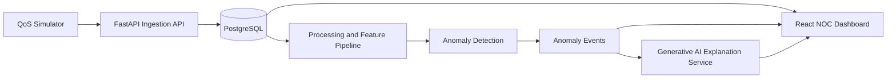

# AI-Driven Broadband Network QoS Monitoring Platform

Final year dissertation project:

**AI-Driven Broadband Network Quality of Service (QoS) Monitoring, Analysis and Performance Optimisation using Generative AI**

This project implements a simplified Network Operations Centre (NOC) platform for broadband QoS monitoring. It uses a realistic network simulator, a Python FastAPI backend, PostgreSQL time-series storage, anomaly detection, and Generative AI explanations.

## Objectives

1. Simulate broadband network QoS measurements.
2. Collect and analyse latency, jitter, packet loss, throughput, bandwidth utilisation, signal quality, and availability.
3. Build a Python backend for ingestion, processing, anomaly detection, and AI-assisted analysis.
4. Build a web dashboard for live metrics, historical trends, health status, detected issues, and recommendations.
5. Integrate Generative AI to explain network degradation and suggest corrective actions.

## Recommended Stack

- **Frontend:** React, Vite, Chart.js
- **Backend:** Python, FastAPI, SQLAlchemy, Pydantic
- **Database:** PostgreSQL
- **ML:** scikit-learn Isolation Forest baseline, with optional Autoencoder or Random Forest extension
- **AI:** OpenAI-compatible LLM API, with rule-based fallback for offline demonstrations
- **Testing:** pytest, FastAPI TestClient, frontend component tests, simulator scenario validation

## High-Level Architecture



## Folder Structure

```text
FYP/
  backend/
    app/
      api/
      core/
      db/
      models/
      schemas/
      services/
      main.py
    ml/
      features/
      models/
      training/
    simulator/
      scenarios/
      generator.py
    tests/
  frontend/
    src/
      components/
      pages/
      services/
      charts/
      styles/
    public/
  database/
    schema.sql
    seed.sql
  docs/
    architecture.md
    api-design.md
    database-schema.md
    roadmap.md
    testing-methodology.md
  scripts/
```

## Development Phases

1. **Phase 1: Architecture and structure**
   Define architecture, data model, APIs, folder layout, simulation scenarios, and testing approach.

2. **Phase 2: QoS simulator**
   Generate realistic broadband metrics for normal service, congestion, latency spikes, packet loss, bandwidth limits, and outage scenarios.

3. **Phase 3: Backend and database**
   Implement FastAPI ingestion, PostgreSQL persistence, and historical metric query endpoints.

4. **Phase 4: ML anomaly detection**
   Add feature engineering and Isolation Forest anomaly detection, then evaluate against simulator ground truth.

5. **Phase 5: Dashboard**
   Build a responsive React dashboard with live health cards, charts, event lists, and recommendations.

6. **Phase 6: Generative AI analysis**
   Add natural-language performance summaries, likely causes, and corrective actions.

7. **Phase 7: Testing and dissertation documentation**
   Validate the system, collect results, create screenshots, write evaluation, and prepare dissertation material.

## Current Status

- **Phase 1 complete:** architecture, schema, API design, roadmap, folder scaffold
- **Phase 2 complete:** broadband QoS simulator with scenario engine, CSV export, and API publisher
- **Phase 3 complete:** FastAPI backend, SQLAlchemy models, database, and metric APIs
- **Phase 5 dashboard complete:** React NOC UI with live metrics, charts, issues, and AI synopsis
- **Phase 4 complete:** Isolation Forest anomaly detection, hybrid scoring, `/api/anomalies/run`
- **Phase 6 complete:** Generative AI analysis with offline fallback and dashboard Analyse button

### Train / run anomaly detection

```bash
python -m backend.ml.train --samples 200
python -m backend.ml.evaluate --samples 120

# With backend running:
curl -X POST "http://127.0.0.1:8000/api/anomalies/run?limit=500"
```

### Run AI analysis

```bash
# Offline fallback works with no API key
curl -X POST http://127.0.0.1:8000/api/analyze \
  -H "Content-Type: application/json" \
  -d "{\"node_code\": \"BNG-DXB-001\"}"
```

Optional: set `QOS_OPENAI_API_KEY` in `backend/.env` for live LLM responses.
```bash
pip install -r backend/requirements.txt
```

### Run the backend

```bash
python scripts/run_backend.py --reload
# API docs at http://localhost:8000/docs
```

The backend uses SQLite by default (no setup). To use PostgreSQL, see `backend/app/README.md`.

### Open the dashboard

```bash
# Terminal 1 — backend
python scripts/run_backend.py

# Terminal 2 — live simulator feeding the API
python -m backend.simulator --mode live --ticks 0 --interval 3 --publish-api

# Terminal 3 — frontend
cd frontend
npm install
npm run dev
```

Then open **http://localhost:5173**

### Run the simulator

```bash
# Historical labelled dataset (writes data/simulator/*.csv)
python -m backend.simulator --mode batch --samples 120 --seed 42

# Live ticks
python -m backend.simulator --mode live --ticks 20 --interval 2

# Live ticks published to the backend
python -m backend.simulator --mode live --ticks 20 --interval 2 --publish-api

# Force a congestion demo
python -m backend.simulator --mode batch --samples 50 --force-scenario congestion
```

### Tests

```bash
python -m unittest backend.tests.test_simulator -v
python -m pytest backend/tests/test_api.py -v
```

## First Build Milestone

The first working version should run locally with:

- One simulator process producing QoS measurements every few seconds.
- One FastAPI backend receiving and storing measurements.
- One React dashboard polling latest metrics.
- One ML service flagging obvious anomalies.
- One AI endpoint summarising the latest network condition.
