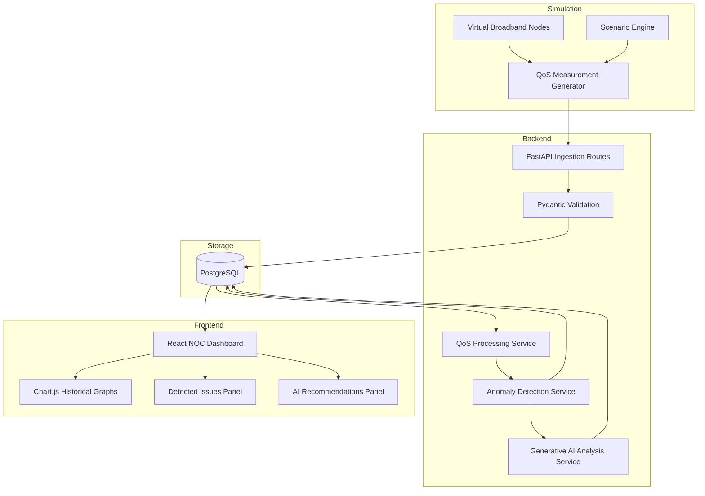

# System Architecture

## Project Scope

The system is a local, simulated broadband QoS monitoring platform. It is designed to be realistic enough for a Telecommunications Engineering final year project while remaining achievable within 4-5 months.

The platform models an ISP monitoring workflow:

1. Broadband access nodes produce QoS measurements.
2. A backend ingests and stores the measurements.
3. A processing pipeline calculates health indicators and ML features.
4. An anomaly detector identifies degraded network behaviour.
5. A Generative AI service explains the problem and recommends corrective action.
6. A web dashboard presents live and historical network status.

## Architecture Diagram

## QoS Metrics

- **Latency:** Round-trip delay in milliseconds. High latency suggests congestion, routing issues, or backhaul delay.
- **Jitter:** Variation in latency in milliseconds. High jitter affects real-time traffic such as VoIP and video calls.
- **Packet loss:** Percentage of packets lost. Loss may indicate congestion, noisy links, queue overflow, or equipment problems.
- **Throughput:** Achieved data rate in Mbps. Low throughput can indicate congestion, bandwidth caps, or poor signal quality.
- **Bandwidth utilisation:** Percentage of available link capacity currently used. Sustained high utilisation is a congestion indicator.
- **Signal quality:** Optional access-layer quality indicator, represented as SNR or a normalised signal score.
- **Availability:** Percentage or binary status showing whether the node/service is reachable.

## Simulated Network Model

The simulator should generate measurements for multiple virtual broadband nodes. Each node represents a neighbourhood, access segment, or subscriber group.

Recommended node attributes:

- `node_id`
- `region`
- `access_technology`, such as FTTH, DSL, fixed wireless, or cable
- `service_tier_mbps`
- `subscriber_count`
- `baseline_latency_ms`
- `max_bandwidth_mbps`

## Simulation Scenarios

1. **Normal operation**
   Moderate utilisation, stable latency, low jitter, near-zero packet loss, and high availability.

2. **Peak-hour congestion**
   High utilisation, increasing latency and jitter, reduced throughput, and occasional packet loss.

3. **High latency event**
   Latency rises sharply while packet loss may remain low. This models routing delay or backhaul issues.

4. **Packet loss event**
   Packet loss increases with jitter. This models noisy links, faulty equipment, or buffer overflow.

5. **Bandwidth limitation**
   Throughput remains below expected service tier even when demand is high. This models throttling, capacity limits, or configuration problems.

6. **Availability degradation**
   Measurements show service interruption or intermittent reachability.

## ML and AI Flow

1. Raw QoS measurements are stored in PostgreSQL.
2. Feature engineering calculates rolling averages, deviations from baseline, and combined health indicators.
3. Isolation Forest scores each sample or time window.
4. Rule-based classification maps anomalies to telecom-readable incident types.
5. Generative AI receives structured context:
   - affected node
   - recent QoS values
   - baseline comparison
   - anomaly score
   - suspected scenario
6. The AI service returns:
   - plain-language explanation
   - likely causes
   - recommended corrective actions
   - severity summary

## Deployment Model

For the final year project, local deployment is sufficient:

- PostgreSQL runs locally or through Docker.
- FastAPI runs on `localhost:8000`.
- React runs on `localhost:5173`.
- The simulator runs as a Python process or scheduled background task.

This is realistic for demonstration and dissertation evaluation without requiring physical telecom equipment.
